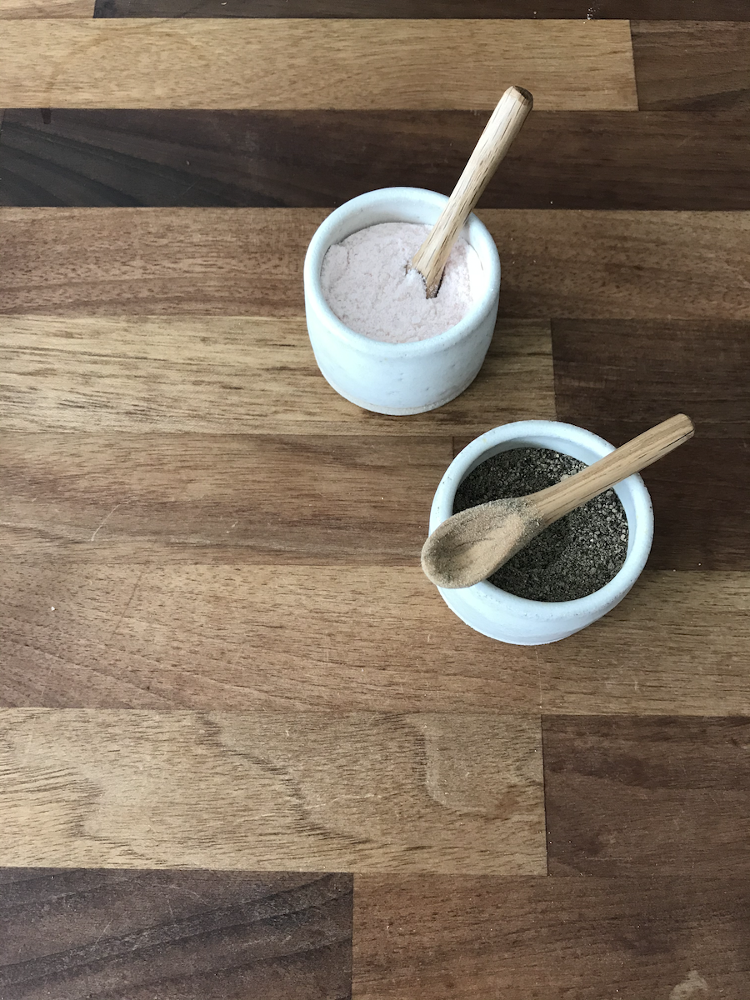

I made a blog! How exciting. The logical followup question – other than 'how did I end up here?', of course – is: **why?** In economic terms, blogs are `all supply, no demand`, but on the off-chance that a recruiter or conference/meetup host is vetting me for a job or event, then there will be a sudden spike in `demand` for information on Jon Linnell, at which point this investment will have paid off.

I also require a creative outlet for writing; I've spent most of my life writing in some medium or another, and doing a BSc in Communications at university did nothing to staunch the flow of nonsense spewing forth. It just made the words longer.

I'm also, apparently, a bit of a narcissist. You might have worked this out already by the fact that of this introductory article's four paragraphs, each one begins with 'I', and I referenced myself in the third person before the end of the first. To quote a great orator,

> It's the old demagogue in me; I need the pulpit, I need the podium.

I'm sure I'll write a lot more interesting things in the future. Although code will feature heavily, I'm sure, I'm also into music, cinema, languages, and various other random things that I'm sure will make an appearance here and there.

## Reminders

This section, if you take a peek at [the code](https://www.github.com/jonlinnell/blog/blob/master/content/blog/hello-world/index.mdx), is all about reminding me what syntax to use for various things.

### Images

Like this:


### Code
```js
  const numbers = [1, 2, 3, 4, 5, '6', '7'];

  const actualNumbers = numbers
    .map(number => Number(number));
```

### Live code!

```jsx react-live
const handleClick = () => window.alert(`The date is: ${(new Date()).toISOString()}`);

const Button = () => <button data-test={true} type="button" label="show the date" onClick={handleClick}>What's the date?</button>;

render(<Button />);
```
